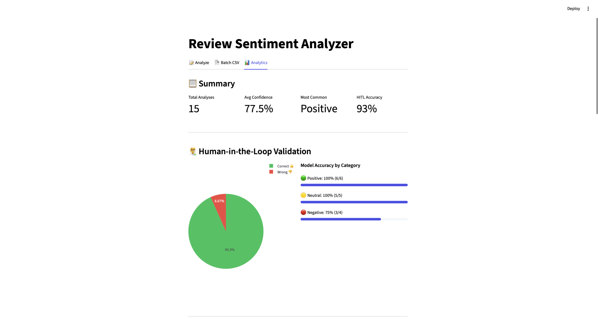

# Review-Sentiment-Analyzer


## Overview
This project implements a sentiment analysis system for e-commerce product reviews using transformer-based language models. The goal is to classify customer reviews into **negative, neutral, or positive** sentiment while ensuring strong generalization, interpretability, and responsible deployment.

A key focus of this project is **controlled fine-tuning**: adapting a pretrained language model to a new domain without overfitting or compromising reliability.

---

## Business Value & Target Audience

This project is best suited for **B2B use cases**, where internal teams analyze large volumes of customer reviews to support product decisions, customer support prioritization, quality monitoring, and operational insights.

The system is designed for internal analytics and decision support rather than direct consumer-facing applications, making it a strong fit for e-commerce platforms, marketplace operators, and enterprise teams.

---

## Set Up & Deployment

First, clone the repository:

```
git clone https://github.com/Carlomos7/review-sentiment-analyzer.git
cd review-sentiment-analyzer
```
This project requires **Python 3.12 or higher**. Earlier Python versions are not supported.

### Option A: Run via API (Production / Integration)

#### 1. Setup Model
Download the model [(here)](https://drive.google.com/file/d/1uwHqDT7UyKgVMDgffo4NnetaYbRbqgZt/view?usp=drive_link) and unzip the model folder. Place it in the ``models/`` directory:

``` 
models/
  └── final_model/
      ├── config.json
      └── tf_model.h5
```
#### 2. Run the API
```
docker compose up --build
```

to stop:

```
docker compose down
```

#### 3. Test the API
Open http://localhost:8000/docs for interactive docs. You can test the predict endpoint directly here:

**Example Request:**
```
curl -X POST http://localhost:8000/predict \
  -H "Content-Type: application/json" \
  -d '{"text": "Love this dress!"}'
```
**Example Response:**
```
{
  "label": "positive",
  "confidence": 0.996
}

**Note:** The API automatically loads the model from models/final_model/ on startup. 

```

### Option B: Run via Streamlit UI (Demo / Visualization)

#### 1. Install
```
pip install streamlit
pip install plotly
```

#### 2. Run Streamlit

```
streamlit run app/dashboard.py
```

#### 3. Test 
Open http://localhost:8501/ in your browser to interact with the application.

Example input:
```text
Love this dress!
```
Review model performance charts.

---

## Data
- **Dataset:** [Women’s E-Commerce Clothing Reviews](https://www.kaggle.com/datasets/nicapotato/womens-ecommerce-clothing-reviews)
- **Inputs:** Review title + review text
- **Labels:** Derived from star ratings  
  - 1–2 stars → Negative  
  - 3 stars → Neutral  
  - 4–5 stars → Positive  

The dataset was split into **training, validation, and test sets (80/10/10)** to ensure unbiased evaluation.

---

## Planned Models & Model Selection

Several transformer-based sentiment models were evaluated before selecting the final approach.

---

### 1. [Twitter RoBERTa](https://huggingface.co/cardiffnlp/twitter-roberta-base-sentiment-latest) (Final Choice)

**Model:** Twitter RoBERTa sentiment model  
**Architecture:** RoBERTa (Robustly Optimized BERT Approach)
**Pretraining Data:** Large-scale Twitter sentiment data  

**Overview:**  
RoBERTa is an optimized variant of BERT that improves performance by training longer, using larger batches, and removing the next-sentence prediction objective. When fine-tuned on Twitter data, it is particularly effective at capturing informal language, sarcasm, and sentiment-heavy expressions.

**Why Twitter RoBERTa was chosen:**  
- Strong performance on sentiment classification benchmarks
- Well-suited for short, opinion-rich text similar to customer reviews
- Robust handling of informal language, emojis, and expressive phrasing
- Stable and efficient fine-tuning behavior for downstream sentiment tasks 

---

### 2. [Amazon Sentiment Analysis Model](https://huggingface.co/LiYuan/amazon-review-sentiment-analysis) (Considered)

**Overview:**  
Models trained on Amazon reviews offer strong domain alignment for e-commerce sentiment analysis.

**Why it was not selected:**  
- Limited flexibility for controlled fine-tuning  
- Less transparency in training and label mapping  
- Often optimized for binary sentiment classification 


---

### 3. [DistilBERT](https://huggingface.co/distilbert/distilbert-base-uncased) (Considered)

**Overview:**  
DistilBERT is a lightweight transformer optimized for speed and efficiency.

**Why it was not selected:**  
- Reduced representational capacity  
- Lacks human in the loop during labeling
- Lower performance on nuanced sentiment classification  
- Less effective for neutral or mixed reviews  

---

## Model Scope, Limitations, & ML Engineering Concerns

### Model Scope
This model is designed to:
- Classify **overall sentiment** of English-language product reviews
- Operate on short to medium-length text
- Support exploratory analysis and decision support

### Limitations
- Does **not** perform aspect-based sentiment analysis (e.g., fit vs price)
- May struggle with sarcasm, irony, or highly ambiguous language
- Performance depends on the quality of rating-to-sentiment mapping
- Not suitable for safety-critical or high-stakes automated decisions

The model should be used as an **assistive tool**, not a sole decision-maker.

### ML Engineering Concerns
- **Class Over-Representation Risk**  
  Overabundance of positive reviews can bias models toward majority classes, leading to overfitting. This project mitigates risk through class-aware evaluation, early stopping, and dataset balancing strategies.

- **Continuous Learning & Model Stability**  
  Periodic retraining with fresh, sanitized review data helps maintain performance as customer language, products, and expectations evolve.

---

## Model & Training Strategy Documentation
- **Framework:** TensorFlow / Keras  
- **Architecture:** Pretrained transformer encoder + classification head  
- **Activation:** GELU (default transformer activation for stable fine-tuning)


### Fine-Tuning Approach
#### Challenge 1: Overfitting
- **Half of the transformer encoder layers were frozen**
- Reduced learning rates ensured stable parameter updates
- Early stopping was applied based on validation accuracy

This preserved pretrained language knowledge while allowing domain adaptation.

#### Challenge 2: Misleading Accuracy Measurements
Initial evaluation compared mismatched label formats.

**Solution:**  
- Standardized label encoding  
- Added proper validation and test evaluation   

#### Challenge 3: Class Imbalance
Positive reviews were overrepresented, causing overfitting

**Solution:**  
- Using early stopping to prevent overtraining 

---

### Twitter RoBERTa vs Amazon Sentiment Analysis Model
#### Amazon Sentiment Analysis Model
```
Fine-tuning for up to 3 epochs...
============================================================
Epoch 1/3
1132/1132 [==============================] - ETA: 0s - loss: 0.3431 - accuracy: 0.8500
Epoch 1: val_loss improved from inf to 0.31165, saving model to runs/run_20251231_200750/checkpoints/best_model.keras
/usr/local/lib/python3.12/dist-packages/transformers/generation/tf_utils.py:465: UserWarning: `seed_generator` is deprecated and will be removed in a future version.
  warnings.warn("`seed_generator` is deprecated and will be removed in a future version.", UserWarning)
1132/1132 [==============================] - 784s 645ms/step - loss: 0.3431 - accuracy: 0.8500 - val_loss: 0.3117 - val_accuracy: 0.8657 - lr: 2.0000e-05
Epoch 2/3
1132/1132 [==============================] - ETA: 0s - loss: 0.2855 - accuracy: 0.8764
Epoch 2: val_loss did not improve from 0.31165

Epoch 2: ReduceLROnPlateau reducing learning rate to 9.999999747378752e-06.
1132/1132 [==============================] - 684s 605ms/step - loss: 0.2855 - accuracy: 0.8764 - val_loss: 0.3326 - val_accuracy: 0.8489 - lr: 2.0000e-05
Epoch 3/3
1132/1132 [==============================] - ETA: 0s - loss: 0.2078 - accuracy: 0.9104
Epoch 3: val_loss did not improve from 0.31165

Epoch 3: ReduceLROnPlateau reducing learning rate to 4.999999873689376e-06.
1132/1132 [==============================] - 685s 605ms/step - loss: 0.2078 - accuracy: 0.9104 - val_loss: 0.3838 - val_accuracy: 0.8608 - lr: 1.0000e-05
Epoch 3: early stopping
Restoring model weights from the end of the best epoch: 1.
```
Epoch 1 showed strong learning and generalization, achieving 85.0% training accuracy and 86.6% validation accuracy. This epoch produced the best validation loss, and the model checkpoint was saved. Epochs 2 and 3 continued to improve training accuracy (up to 91.0%), but validation loss increased, indicating the start of overfitting. 

#### Twitter RoBERTa
```
Fine-tuning for up to 3 epochs...
============================================================
Epoch 1/3
WARNING: All log messages before absl::InitializeLog() is called are written to STDERR
I0000 00:00:1767297847.978148  481581 service.cc:152] XLA service 0x78fcd9c95a30 initialized for platform CUDA (this does not guarantee that XLA will be used). Devices:
I0000 00:00:1767297847.986650  481581 service.cc:160]   StreamExecutor device (0): NVIDIA GeForce RTX 3070, Compute Capability 8.6
2026-01-01 15:04:08.238204: I tensorflow/compiler/mlir/tensorflow/utils/dump_mlir_util.cc:269] disabling MLIR crash reproducer, set env var `MLIR_CRASH_REPRODUCER_DIRECTORY` to enable.
I0000 00:00:1767297848.351959  481581 cuda_dnn.cc:529] Loaded cuDNN version 90300
I0000 00:00:1767297848.698696  481581 device_compiler.h:188] Compiled cluster using XLA!  This line is logged at most once for the lifetime of the process.
2263/2263 [==============================] - ETA: 0s - loss: 0.3471 - accuracy: 0.8512
Epoch 1: val_loss improved from inf to 0.34078, saving model to runs/run_20260101_150332/checkpoints/best_model.keras
/home/carloslx/projects/cognizant/.venv/lib/python3.12/site-packages/transformers/generation/tf_utils.py:465: UserWarning: `seed_generator` is deprecated and will be removed in a future version.
  warnings.warn("`seed_generator` is deprecated and will be removed in a future version.", UserWarning)
2263/2263 [==============================] - 415s 172ms/step - loss: 0.3471 - accuracy: 0.8512 - val_loss: 0.3408 - val_accuracy: 0.8546 - lr: 2.0000e-05
Epoch 2/3
2263/2263 [==============================] - ETA: 0s - loss: 0.2934 - accuracy: 0.8714
Epoch 2: val_loss improved from 0.34078 to 0.33083, saving model to runs/run_20260101_150332/checkpoints/best_model.keras
2263/2263 [==============================] - 364s 161ms/step - loss: 0.2934 - accuracy: 0.8714 - val_loss: 0.3308 - val_accuracy: 0.8515 - lr: 2.0000e-05
Epoch 3/3
2263/2263 [==============================] - ETA: 0s - loss: 0.2575 - accuracy: 0.8886
Epoch 3: val_loss did not improve from 0.33083

Epoch 3: ReduceLROnPlateau reducing learning rate to 9.999999747378752e-06.
2263/2263 [==============================] - 357s 158ms/step - loss: 0.2575 - accuracy: 0.8886 - val_loss: 0.3885 - val_accuracy: 0.8577 - lr: 2.0000e-05
Restoring model weights from the end of the best epoch: 2.

Fine-tuning complete!
```
Compared to the Amazon sentiment model, the fine-tuned Twitter RoBERTa model provides better generalization, greater fine-tuning control, and more reliable multi-class sentiment predictions, making it better suited for real-world e-commerce review analysis.

---

## Security & Compliance Considerations

This project is designed with data privacy, compliance, and secure deployment principles in mind:

- **No PII or PHI storage**  
  The system does not intentionally collect or store personal or sensitive information. Text is used only to determine sentiment.

- **Limited data usage**  
  Reviews are processed temporarily for inference only. The model does not remember or reproduce individual reviews.

- **Safe handling in production**  
  Training data, model files, and outputs should be stored securely when used in a real system.

- **Trusted environment assumption**  
  This project assumes it runs in a trusted, internal environment and is not designed to defend against malicious or adversarial input.

**Note:** If used with human reviewers, sensitive information should be removed or masked before anyone sees the text.

---

## Human-in-the-Loop Design
This system is designed to support **human oversight**:

- Predictions can be reviewed and overridden by humans
- Low-confidence or negative predictions can be flagged for manual inspection
- Human feedback can be used to retrain or calibrate the model over time

Human-in-the-loop ensures accountability, fairness, and continuous improvement.

---

## What We Learned
- Large language models can overfit quickly if fine-tuned aggressively
- Freezing encoder layers helps preserve pretrained knowledge
- Validation metrics are critical for judging real performance
- Responsible ML design includes scope definition and human oversight

---

## Business Applications (B2B Focus)

### Use Cases

This sentiment analysis system can be applied across multiple industries to support faster decision-making, risk mitigation, and revenue optimization:

- **E-commerce platforms**  
  Automatically adjust product rankings and visibility based on real-time sentiment trends, helping surface high-quality products and reduce exposure to poorly performing ones.

- **Marketplace sellers and operators**  
  Monitor sentiment across competitors and categories to inform pricing strategies, inventory planning, and seller performance evaluation.

- **Customer support teams**  
  Prioritize and route support tickets based on spikes in negative sentiment, improving response times and customer satisfaction.

- **Compliance and risk management tools**  
  Integrate sentiment analysis with PHI/PII screening to ensure sensitive information is flagged or removed before analyst review.

- **Fashion and retail brands**  
  Quantify how customer sentiment impacts conversion rates and revenue, enabling more accurate demand forecasting and merchandising decisions.

- **Logistics and fulfillment providers**  
  Analyze delivery-related sentiment to predict return risk, identify service issues, and optimize fulfillment routes and partners.

---

### Business Considerations & System Design
Beyond model accuracy, real-world sentiment analysis systems must account for downstream business impact, operational cost, and compliance constraints. This project incorporates the following considerations to ensure production readiness:
- **Sentiment → Rating Impact**  
  Customer sentiment directly influences product ratings and visibility (e.g., Amazon-style ranking systems). Negative sentiment trends should surface early to prevent long-term rating degradation.

- **Model Placement & Platform Fairness**  
  Marketplace platforms require sentiment models that operate fairly across multiple sellers, while D2C deployments must carefully manage brand reputation to avoid over-weighting negative feedback during short-term fluctuations.

- **Human-in-the-Loop (HITL) Cost Control**  
  To limit operational expenses, human review is best reserved for high-risk or newly launched products, where sentiment signals are most actionable.

---

## Conclusion
This project highlights the importance of thoughtful model selection, controlled fine-tuning, and ethical deployment practices. By defining scope, addressing limitations, and incorporating human oversight, the resulting sentiment analysis system is both technically robust and responsibly designed.

---

## Contributors
This project was originally collaborated on in Google Colab by:

Carlos Segarra, Jeffrey Abisai Mazariegos Lemus, Marlon Munoz, Hayden Ferguson, Kyle Anthony Hay, Chenchen Liu
